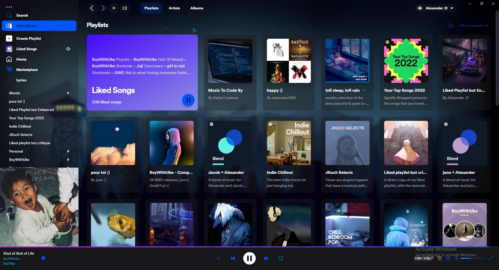

<h1 align="center">Retroblur (GalexY edit)</h1>
<p align="center">Spicetify theme with lots of blur and retro elements.<br>
Based on https://github.com/Motschen/Retroblur based on https://github.com/schnensch0/ziro <br>
Copyright © 2022 Motschen - MIT License<br>





</p>

## Installation

After installing Spicetify with [their instructions](https://spicetify.app/docs/getting-started), 
clone this repository into 

`C:\Users\USERNAME\AppData\Roaming\spicetify\Themes\`


Then, open a terminal and type:

```bash
spicetify config current_theme galexy
spicetify config color_scheme blue
spicetify apply
```


To change the background, 
edit the link on in [user.css](https://github.com/GalexY727/Retroblur-GalexY/blob/main/user.css#L30) (line 30 or so)


If you need any inspiration, check out my [wallpaper of the day](https://github.com/galexy727#-wallpaper-of-the-day)!