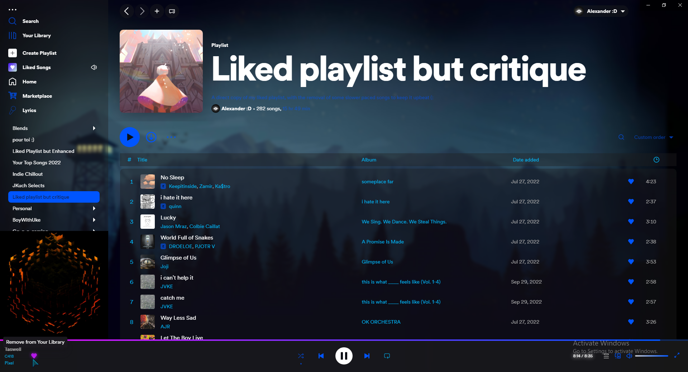

<h1 align="center">Retroblur</h1>

Spicetify theme with lots of blur and retro elements. 
Based on https://github.com/Motschen/Retroblur based on https://github.com/schnensch0/ziro  
Copyright © 2022 Motschen - MIT License 

To change the color of the background, edit the link on the first line of user.css  
It's sadly not possible to change the background together with the color scheme automatically due to the limitations of CSS.
 

